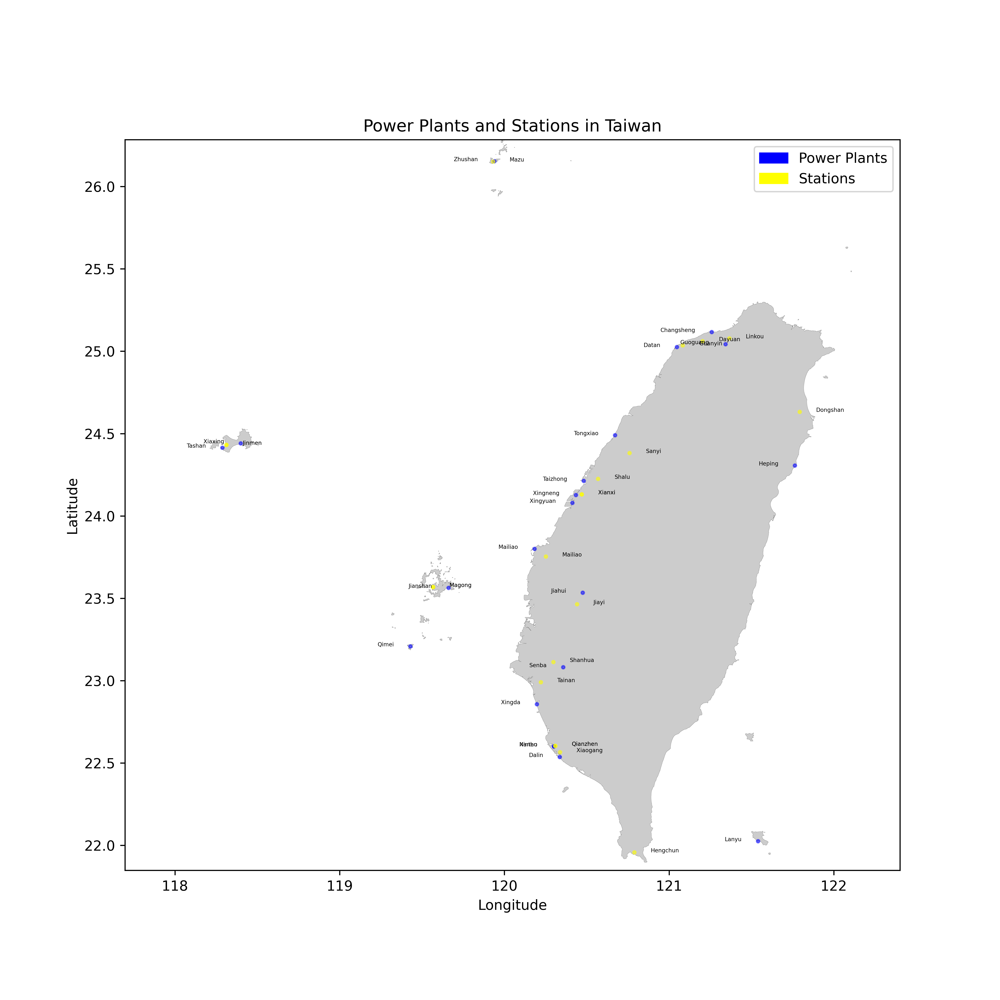
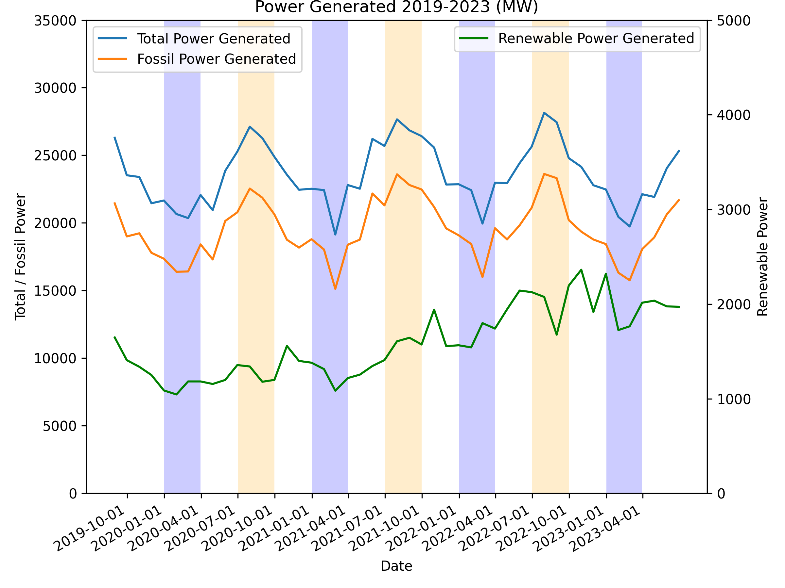
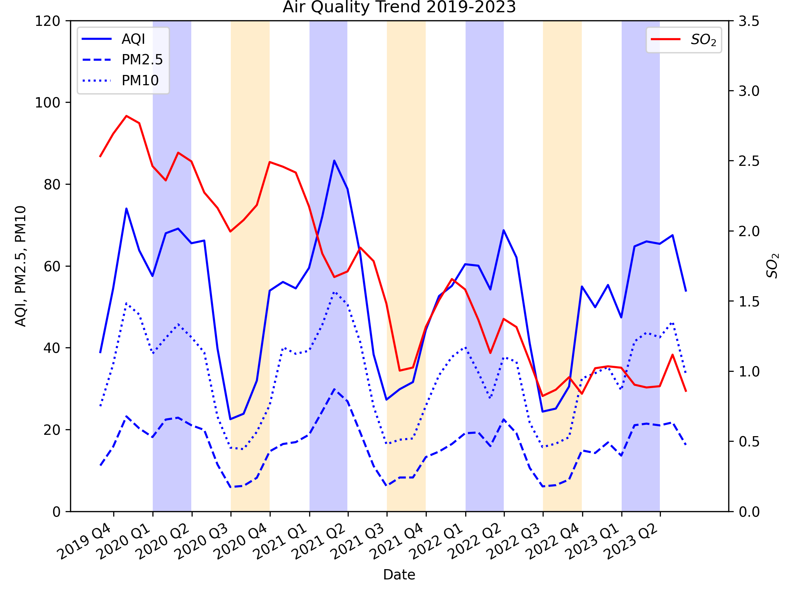
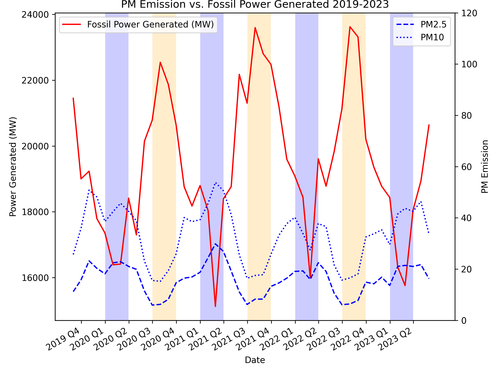
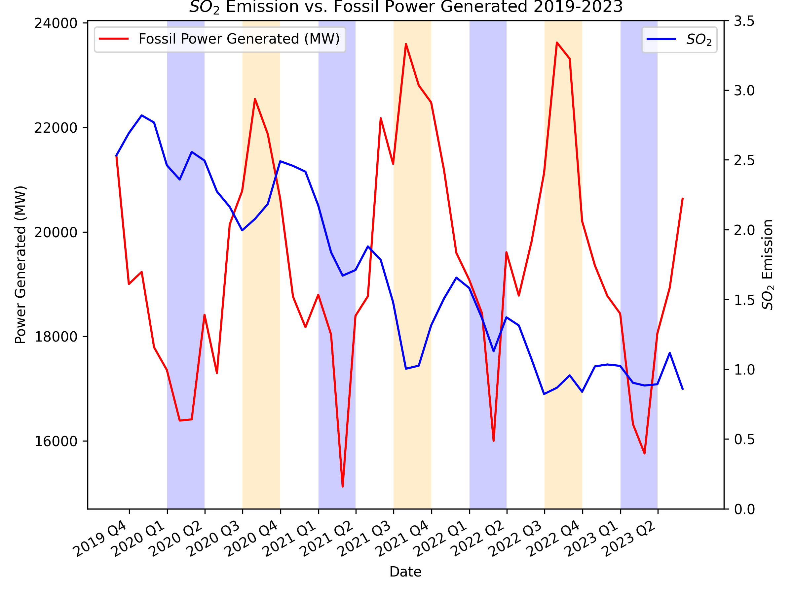

# Fossil Power vs Air Quality in Taiwan

This repository analyzes whether air pollution trends near Taiwan's fossil-fuel power plants move with national fossil power generation. The project links each fossil power plant to its nearest EPA air-quality monitoring station, downloads station records, aggregates the measurements, and compares them with national power-generation data from 2019 to 2023.

The work is organized as a notebook-driven data project. Intermediate CSV files and final figures are already checked into the repository.

## Project Question

How do air-quality indicators near Taiwan's fossil power plants change alongside fossil power generation trends?

The current analysis focuses on:

- `AQI`
- `PM2.5`
- `PM10`
- `SO2`
- national total and fossil power generation

## Repository Contents

### Notebooks

- `find_plant_station_20230623.ipynb`: loads power-plant and monitoring-station coordinates and finds the nearest station for each plant.
- `data_acqusition_20230723.ipynb`: early exploratory notebook for joining plant and station data, mapping, and geospatial plotting.
- `station_data_acquisition_20230826.ipynb`: downloads station time-series records, weights them by plant capacity, and writes the aggregated monthly dataset.
- `geo_data_analysis_20230901.ipynb`: geospatial visualization work using Taiwan shapefiles and marker maps.
- `assignment4.ipynb`: the most complete narrative notebook, combining the workflow, plots, and final comparison between air-quality and power-generation trends.

### Data Files

- `Power Plant Locations.csv`: 21 fossil power plants with names, coordinates, and capacity.
- `Station Locations.csv`: 78 Taiwan air-quality monitoring stations with site metadata and coordinates.
- `Plant Station Location_20230820.csv`: plant-to-nearest-station lookup table used by later notebooks.
- `Power Data_20230827.csv`: national monthly power-generation statistics.
- `plant_station_record_avg.csv`: monthly aggregated air-quality dataset produced from downloaded station records.
- `Data/`: per-plant/per-station historical air-quality records used to build the aggregate dataset.
- `TW Map/`: Taiwan administrative boundary shapefiles used for map visualizations.

### Figures

The repository already includes output figures generated from the analysis, and they are embedded below in the results section.

## Workflow

1. Load fossil power plant locations and air-quality station metadata.
2. Parse coordinates and find the nearest monitoring station for each plant.
3. Download hourly or daily station records from the public air-quality API.
4. Weight each station series by the matched plant capacity.
5. Resample to monthly averages and export `plant_station_record_avg.csv`.
6. Compare air-quality trends with national fossil power generation.
7. Plot time-series charts and Taiwan maps.

## Main Inputs and Outputs

### Inputs

- Taiwan Ministry of Environment air-quality station data
- Taiwan national power-generation statistics
- power-plant location and capacity data
- Taiwan administrative boundary shapefiles

### Outputs

- nearest-station lookup for each fossil power plant
- monthly weighted air-quality averages near fossil plants
- trend charts comparing pollution indicators with power generation
- geospatial maps of plants and monitoring stations

## Environment

The notebooks import the following Python packages:

- `pandas`
- `numpy`
- `matplotlib`
- `requests`
- `geopandas`
- `folium`
- `opencv-python` (`cv2`)

A minimal setup is:

```bash
python -m venv .venv
.venv\Scripts\activate
pip install pandas numpy matplotlib requests geopandas folium opencv-python jupyter
```

## Running the Project

Open the notebooks in roughly this order if you want to reproduce the workflow:

1. `find_plant_station_20230623.ipynb`
2. `station_data_acquisition_20230826.ipynb`
3. `geo_data_analysis_20230901.ipynb`
4. `assignment4.ipynb`

Launch Jupyter with:

```bash
jupyter notebook
```

## Results

### Plant and Station Map

This map shows the fossil power plants and their matched monitoring stations across Taiwan.



### Power Generation Trend

National total and fossil power generation show a repeating seasonal pattern, while renewable generation trends upward over time.



### Air Quality Trend

The weighted air-quality series near fossil power plants shows seasonal variation in `AQI`, `PM2.5`, and `PM10`, while `SO2` generally declines over the period.



### PM vs. Fossil Power

This comparison overlays fossil power generation with `PM2.5` and `PM10`.



### SO2 vs. Fossil Power

This comparison overlays fossil power generation with `SO2`.



## Conclusions

- Fossil power generation appears strongly seasonal, with repeated peaks and troughs across 2019-2023.
- `PM2.5` and `PM10` near matched plant stations also show seasonal movement, but their peaks do not align perfectly with fossil generation in every period.
- `SO2` shows the clearest long-term directional change: it trends downward from 2019 to 2023 even while fossil generation continues to fluctuate seasonally.
- Renewable generation rises over the same period, while total generation remains broadly seasonal.
- Based on these charts alone, the project suggests association in seasonal patterns, but not a simple one-to-one relationship between higher fossil generation and higher particulate pollution.

## Notes

- This is a notebook-first project rather than a packaged Python module.
- Several files use date-stamped names, which helps track the evolution of the analysis.
- One notebook is named `data_acqusition_20230723.ipynb`; the filename uses the original spelling in the repository.
